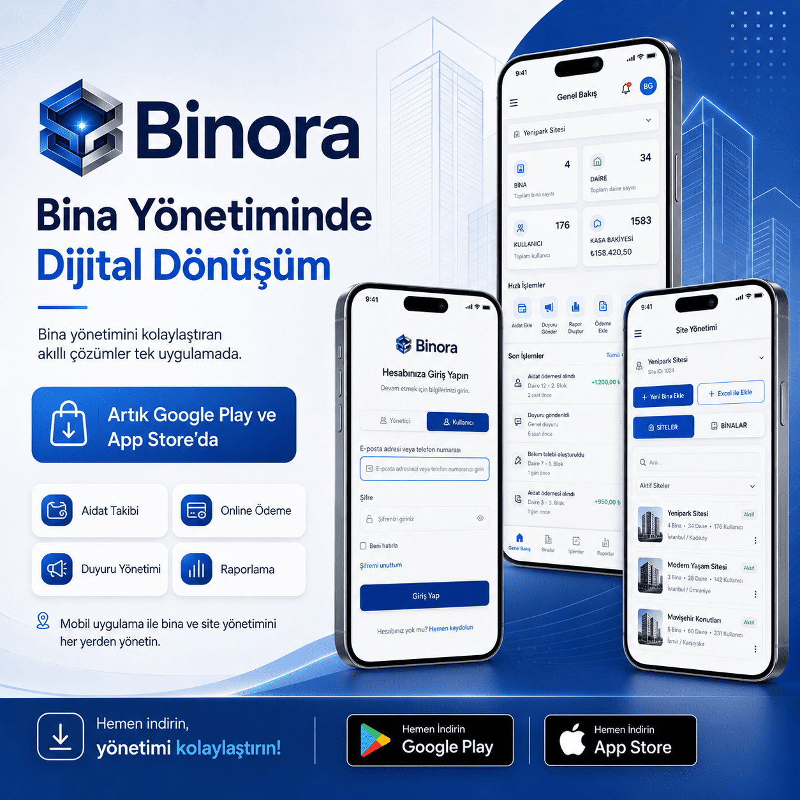
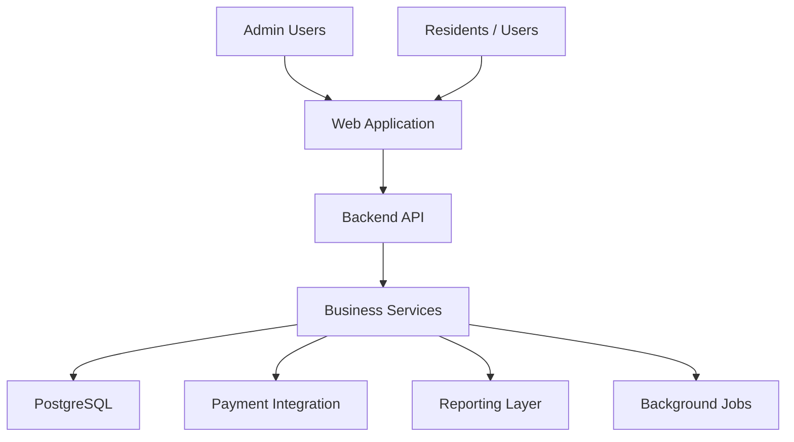
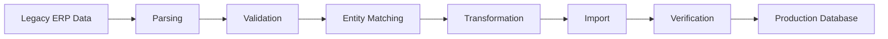

<p align="center">
  
</p>
<p align="center">
  <b>Production-ready project showcase</b>
</p>
<div align="center">

# Binora ERP Case Study

### Multi-Module ERP & SaaS Platform

A case study describing the architecture, responsibilities and engineering decisions behind a production-oriented ERP/SaaS platform for property and financial management.

</div>

---

## Overview

Binora is an ERP/SaaS platform designed around operational and financial workflows.

The system brings together modules such as user and property management, debt tracking, income and expense operations, cash management, online payments and reporting.

This repository contains no proprietary source code. It documents the engineering approach, system responsibilities and architectural decisions used in the project.

---

## Core Capabilities

- Multi-tenant business structure
- User and role management
- Property / building management
- Unit and resident management
- Debt and accrual tracking
- Income management
- Expense management
- Cashbox operations
- Online payment workflows
- Financial reporting
- Administrative dashboards
- Historical data migration
- Operational reporting

---

## System Architecture



---

## Domain Structure

```text
Company
  ├── Properties
  │    ├── Units
  │    └── Users
  ├── Financial Operations
  │    ├── Debts / Accruals
  │    ├── Payments
  │    ├── Income
  │    └── Expenses
  ├── Cashboxes
  └── Reports
```

---

## Engineering Responsibilities

My work on the platform included:

- Full-stack application development
- Database-oriented business logic
- Financial workflow implementation
- Data migration and import processes
- User and property relationship management
- Payment-related workflows
- Reporting logic
- Backend integration
- Debugging and production issue resolution
- Docker-based environment management
- PostgreSQL data operations

---

## Data Migration

A major engineering requirement was importing historical ERP data into the new platform while preserving operational continuity.

The migration process included:

- Historical debt records
- Income records
- Expense records
- User records
- Former residents
- Property relationships
- Cashbox mappings
- Financial categories

The migration workflow included validation, matching, dry-run checks and post-import verification.

---

## Migration Strategy



---

## Database Considerations

The system relies heavily on relational data.

Key relationships include:

- Company → Properties
- Property → Units
- Unit → Users
- User → Debts
- Debt → Payments
- Company → Cashboxes
- Transactions → Categories

PostgreSQL is used as the primary relational database.

---

## Financial Workflows

The ERP includes workflows for:

### Debt Management

- Debt creation
- Due dates
- Payment status
- User association
- Historical records

### Income Management

- Income entry
- Category assignment
- Cashbox assignment
- Payment method handling

### Expense Management

- Expense entry
- Category management
- Payment method handling
- Financial reporting

### Online Payments

- User debt visibility
- Payment processing
- Payment record creation
- Payment status tracking

---

## Deployment & Infrastructure

The platform uses containerized services for local and production-oriented environments.

Typical components include:

```text
Frontend
Backend
Worker
PostgreSQL
Redis
```

Docker is used to isolate services and simplify deployment and environment management.

---

## Tech Stack

| Area | Technology |
|---|---|
| Database | PostgreSQL |
| Containers | Docker |
| Cache / Queue | Redis |
| Backend | REST API Architecture |
| Frontend | Web Application |
| Data Migration | Node.js Scripts |
| Infrastructure | Linux / Containerized Services |
| Domain | ERP / SaaS / Financial Management |

---

## Engineering Challenges

### Historical Data Migration

Legacy ERP data needed to be imported without breaking current workflows.

### Data Matching

Historical names and records were not always directly aligned with current entities, requiring matching and validation logic.

### Financial Accuracy

Income, expense, debt and payment data required careful verification.

### User Relationships

Current and former residents needed to remain connected to the correct properties and units.

### Operational Continuity

The system had to support ongoing business operations during migration and development.

---

## What This Case Study Demonstrates

- ERP development
- SaaS architecture
- Relational database modeling
- Financial systems
- Data migration
- Business workflow automation
- Docker
- PostgreSQL
- Production debugging
- Backend integration
- Reporting systems
- Multi-tenant application design

---

## Confidentiality

This repository intentionally excludes proprietary source code, credentials, customer data and internal business information.

It exists only as a technical case study.

---

## Author

**Emircan Karadeniz**

[LinkedIn](https://www.linkedin.com/in/emircankaradeniz/)  
[GitHub](https://github.com/emircankaradeniz)

